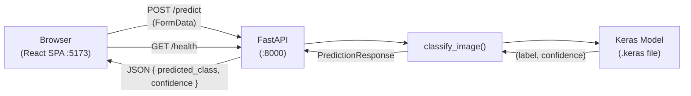
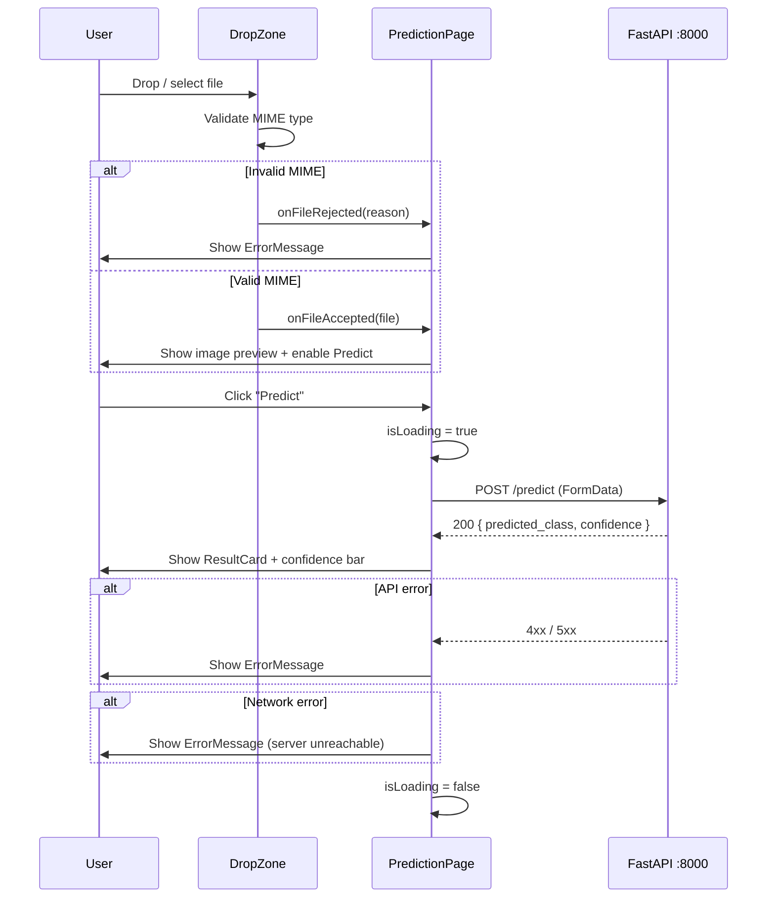

# Design Document — Blood Cell Classifier Web App

## Overview

### Goals

- Add `CORSMiddleware` to the existing FastAPI backend so the browser can call it from a different port.
- Build a four-page React SPA (Home, About, Features, Prediction) that wraps the existing inference API.
- Provide a drag-and-drop image upload experience with client-side MIME validation, image preview, loading state, and a confidence-bar result card.
- Ship a `README.md`, a `TECHNICAL_SUMMARY.md`, backend pytest tests, and frontend Vitest tests.

### Non-Goals

- Retraining or modifying the CNN model.
- User authentication or persistent storage.
- Production deployment (Docker, cloud hosting, etc.).
- Supporting image formats beyond JPEG and PNG.

### Architecture



---

## Frontend Architecture

### Project Structure

```
frontend/
├── index.html
├── package.json
├── vite.config.js
├── tailwind.config.js
├── postcss.config.js
├── src/
│   ├── main.jsx
│   ├── App.jsx
│   ├── index.css
│   ├── pages/
│   │   ├── HomePage.jsx
│   │   ├── AboutPage.jsx
│   │   ├── FeaturesPage.jsx
│   │   └── PredictionPage.jsx
│   ├── components/
│   │   ├── Navbar.jsx
│   │   ├── DropZone.jsx
│   │   ├── PredictButton.jsx
│   │   ├── ResultCard.jsx
│   │   ├── ErrorMessage.jsx
│   │   └── LoadingSpinner.jsx
│   └── hooks/
│       └── usePrediction.js
└── src/
    └── __tests__/
        ├── HomePage.test.jsx
        ├── PredictionPage.test.jsx
        └── Navbar.test.jsx
```

### Component Tree

```
App (BrowserRouter)
├── Navbar                    — persistent on all routes
└── Routes
    ├── Route "/"             → HomePage
    ├── Route "/about"        → AboutPage
    ├── Route "/features"     → FeaturesPage
    └── Route "/predict"      → PredictionPage
                                  ├── DropZone
                                  ├── PredictButton
                                  ├── LoadingSpinner
                                  ├── ResultCard
                                  └── ErrorMessage
```

### React Router Setup

`main.jsx` wraps `<App />` in `<BrowserRouter>`. Inside `App.jsx`:

```jsx
import { Routes, Route } from 'react-router-dom';

<Routes>
  <Route path="/"         element={<HomePage />} />
  <Route path="/about"    element={<AboutPage />} />
  <Route path="/features" element={<FeaturesPage />} />
  <Route path="/predict"  element={<PredictionPage />} />
</Routes>
```

---

## Backend Change

### Adding CORSMiddleware to `ml-server.py`

Insert the following block **immediately after** the `app = FastAPI(...)` instantiation and **before** the first endpoint definition:

```python
from fastapi.middleware.cors import CORSMiddleware

app.add_middleware(
    CORSMiddleware,
    allow_origins=["*"],
    allow_methods=["GET", "POST", "OPTIONS"],
    allow_headers=["*"],
)
```

No other changes to `ml-server.py` are required. The lifespan, endpoints, and response models remain unchanged.

**Rationale**: `allow_origins=["*"]` is acceptable for a local development setup. The frontend runs on port 5173 and the backend on port 8000; without CORS the browser blocks all cross-origin requests.

---

## Component Specifications

### Navbar

**Props**: none (reads current route via `useLocation`)

**Behavior**:
- Renders a horizontal bar with the app name on the left and four `<NavLink>` elements on the right.
- Active link receives the accent color (`#1CBDC9`) via Tailwind's `[&.active]` variant.
- Uses `Menu` / `X` Lucide icons for a mobile hamburger toggle (optional enhancement).

**Key Tailwind classes**:
```
bg-[#172F7C] text-white px-6 py-3 flex items-center justify-between
```
NavLink active class: `text-[#1CBDC9] font-semibold`

---

### DropZone

**Props**:
```ts
interface DropZoneProps {
  onFileAccepted: (file: File) => void;
  onFileRejected: (reason: string) => void;
  previewUrl: string | null;
}
```

**State**: `isDragging: boolean` (controls highlight class)

**Behavior**:
- Handles `onDragOver`, `onDragLeave`, `onDrop`, and `onChange` (hidden `<input type="file">`).
- On drop/select: checks `file.type` against `["image/jpeg", "image/png"]`.
  - Valid → calls `onFileAccepted(file)`.
  - Invalid → calls `onFileRejected("Only JPEG and PNG images are supported.")`.
- When `previewUrl` is set, renders an `` preview inside the zone.

**Key Tailwind classes**:
```
border-2 border-dashed border-[#2DC6B2] rounded-xl p-8 text-center cursor-pointer
transition-colors
```
Drag-active class: `bg-[#2DC6B2]/20 border-[#1CBDC9]`

---

### PredictButton

**Props**:
```ts
interface PredictButtonProps {
  onClick: () => void;
  disabled: boolean;
}
```

**Behavior**:
- Renders a `<button>` that is disabled when `disabled === true`.
- Disabled state: reduced opacity + `cursor-not-allowed`.

**Key Tailwind classes**:
```
bg-[#172F7C] text-white px-6 py-2 rounded-lg font-semibold
hover:bg-[#1CBDC9] disabled:opacity-50 disabled:cursor-not-allowed transition-colors
```

---

### ResultCard

**Props**:
```ts
interface ResultCardProps {
  predictedClass: string;
  confidence: number;   // [0.0, 1.0]
}
```

**Behavior**:
- Displays `predictedClass` as a heading.
- Displays `(confidence * 100).toFixed(2) + "%"` as the percentage label.
- Renders a progress bar: outer track is full-width, inner fill width = `confidence * 100` percent.

**Key Tailwind classes**:
```
bg-[#A2F9AB] rounded-xl p-6 shadow-md
```
Bar track: `bg-gray-200 rounded-full h-4 w-full`
Bar fill: `bg-[#1CBDC9] h-4 rounded-full transition-all`  (inline style `width: ${confidence * 100}%`)

---

### ErrorMessage

**Props**:
```ts
interface ErrorMessageProps {
  message: string;
}
```

**Key Tailwind classes**:
```
text-[#F0756C] bg-[#F0756C]/10 border border-[#F0756C] rounded-lg px-4 py-3 text-sm
```

---

### LoadingSpinner

**Props**: none

**Behavior**: Animated SVG or Tailwind `animate-spin` circle. Shown while the fetch is in progress.

**Key Tailwind classes**:
```
animate-spin h-8 w-8 border-4 border-[#1CBDC9] border-t-transparent rounded-full mx-auto
```

---

### PredictionPage (container)

**State** (managed via `usePrediction` hook):
```ts
file: File | null
previewUrl: string | null
isLoading: boolean
result: { predictedClass: string; confidence: number } | null
error: string | null
```

**Key behavior**:
- `handleFileAccepted(file)`: sets `file`, creates `URL.createObjectURL(file)` for `previewUrl`, clears `result` and `error`.
- `handleFileRejected(reason)`: sets `error = reason`, clears `file`, `previewUrl`, `result`.
- `handlePredict()`: sets `isLoading = true`, builds `FormData`, calls `fetch("http://localhost:8000/predict", ...)`, on success sets `result`, on failure sets `error`, always sets `isLoading = false`.
- `PredictButton` is disabled when `file === null || isLoading === true`.

---

## Data Flow

### Predict Flow (step-by-step)

```
1. User drags/selects a file onto DropZone
2. DropZone checks file.type
   ├── Invalid MIME → ErrorMessage("Only JPEG and PNG images are supported.")
   └── Valid MIME   → previewUrl = URL.createObjectURL(file)
                      PredictButton becomes enabled

3. User clicks "Predict"
4. PredictionPage sets isLoading = true, disables PredictButton
5. Builds FormData: fd.append("file", file)
6. fetch("http://localhost:8000/predict", { method: "POST", body: fd })

7a. Response OK (200)
    → json = { predicted_class, confidence }
    → result = { predictedClass: json.predicted_class, confidence: json.confidence }
    → ResultCard renders with confidence bar width = confidence * 100 %

7b. Response error (4xx / 5xx)
    → error = "Prediction failed. Please try again."
    → ErrorMessage renders

7c. Network error (fetch throws)
    → error = "Could not reach the server. Is the backend running?"
    → ErrorMessage renders

8. isLoading = false, PredictButton re-enabled (if file still selected)
```



---

## Tailwind Configuration

`tailwind.config.js`:

```js
/** @type {import('tailwindcss').Config} */
export default {
  content: ['./index.html', './src/**/*.{js,jsx,ts,tsx}'],
  theme: {
    extend: {
      colors: {
        primary:   '#172F7C',   // deep navy
        secondary: '#2DC6B2',   // teal
        accent:    '#1CBDC9',   // cyan
        success:   '#A2F9AB',   // mint green
        error:     '#F0756C',   // coral
      },
    },
  },
  plugins: [],
};
```

With this config, classes like `bg-primary`, `text-accent`, `border-secondary`, `bg-success`, and `text-error` are available alongside the arbitrary-value classes used in component specs above.

---

## Correctness Properties

*A property is a characteristic or behavior that should hold true across all valid executions of a system — essentially, a formal statement about what the system should do. Properties serve as the bridge between human-readable specifications and machine-verifiable correctness guarantees.*

### Property 1: Confidence bar width matches confidence value

*For any* valid API response with a `confidence` value in [0.0, 1.0], the rendered confidence bar's inline `width` style SHALL equal `confidence * 100` percent, and the displayed percentage text SHALL equal `(confidence * 100).toFixed(2) + "%"`.

**Validates: Requirements 7.4, 7.5**

---

### Property 2: Invalid MIME type always blocks the API call

*For any* file whose `type` is not `"image/jpeg"` or `"image/png"`, the frontend SHALL display an error message and SHALL NOT send any request to `http://localhost:8000/predict`.

**Validates: Requirements 6.4, 6.5**

---

### Property 3: API error always shows error message and never shows ResultCard

*For any* HTTP error response (4xx or 5xx) from `POST /predict`, the frontend SHALL display an `ErrorMessage` component and SHALL NOT render a `ResultCard`.

**Validates: Requirements 7.6, 7.7**

---

### Property 4: Predict button enabled iff valid file selected and not loading

*For any* combination of `(file, isLoading)` state, the Predict button SHALL be enabled if and only if `file !== null && isLoading === false`.

**Validates: Requirements 6.7, 7.3**

---

### Property 5: New file selection clears previous result and error state

*For any* sequence of file selections, selecting a new valid file after a completed prediction SHALL clear both the previous `result` and any `error` state before the next prediction is initiated.

**Validates: Requirements 7.8**

---

### Property 6: Backend confidence rounding is stable

*For any* raw confidence float returned by `classify_image`, the value stored in `PredictionResponse.confidence` SHALL equal `round(raw_confidence, 4)`, and re-rounding that value SHALL produce the same result (idempotence of rounding to 4 decimal places).

**Validates: Requirements 10.4**

---

## Error Handling

| Scenario | Where handled | User-visible outcome |
|---|---|---|
| Non-JPEG/PNG file dropped | `DropZone` (client) | Coral error message; no API call |
| Network unreachable | `PredictionPage` catch block | Coral error: "Could not reach the server. Is the backend running?" |
| API returns 400 (bad image) | `PredictionPage` response check | Coral error: "Prediction failed. Please try again." |
| API returns 500 | `PredictionPage` response check | Coral error: "Prediction failed. Please try again." |
| API returns 404 (model missing) | `PredictionPage` response check | Coral error with status code detail |
| Corrupt image (PIL error) | FastAPI (server) → 400 | Coral error message forwarded from API |

---

## Testing Strategy

### Backend — pytest

**File**: `tests/test_api.py`

**Setup**: Use FastAPI `TestClient`. Patch `classify.classify_image` with `unittest.mock.patch` so no Keras model is loaded during tests.

| Test | Covers |
|---|---|
| `test_health_ok` | Req 10.3 — GET /health → 200 `{"status":"ok"}` |
| `test_predict_valid_jpeg` | Req 10.4 — POST /predict with JPEG → 200, valid class + confidence |
| `test_predict_valid_png` | Req 10.4 — POST /predict with PNG → 200, valid class + confidence |
| `test_predict_invalid_mime` | Req 10.5 — POST /predict with text/plain → 400 exact message |
| `test_predict_no_file` | Req 10.6 — POST /predict with no file → 422 |
| `test_predict_confidence_range` | Req 10.4 — confidence in [0.0, 1.0] |

**Property-based tests** (Hypothesis):

- `test_confidence_rounding_idempotent`: For any float in [0.0, 1.0], `round(round(x, 4), 4) == round(x, 4)` — validates Property 6.
- `test_mime_rejection`: For any MIME type string not in `{"image/jpeg", "image/png"}`, the endpoint returns 400 — validates Property 2.

### Frontend — Vitest + React Testing Library

**File**: `frontend/src/__tests__/`

| Test | Covers |
|---|---|
| `HomePage.test.jsx` — heading present | Req 11.2 |
| `PredictionPage.test.jsx` — DropZone renders | Req 11.3 |
| `PredictionPage.test.jsx` — Predict button renders disabled | Req 11.3 |
| `Navbar.test.jsx` — all four nav links present | Req 11.4 |

**Property-based approach for frontend**: The confidence bar width and MIME validation logic are pure functions; they can be extracted and tested with fast-check (JavaScript PBT library) to validate Properties 1 and 2 without rendering overhead.

**Test runner command**: `npm test -- --run` (single-pass, exits with code 0 on success).

---

## File Deliverables

### Modified

| File | Change |
|---|---|
| `ml-server.py` | Add `CORSMiddleware` after `app = FastAPI(...)` |

### Created

| File | Description |
|---|---|
| `frontend/package.json` | Vite + React 18 + React Router v6 + Tailwind CSS v3 + Lucide-React + Vitest |
| `frontend/vite.config.js` | Vite config with `@vitejs/plugin-react` |
| `frontend/tailwind.config.js` | Theme extension with 5 custom colors |
| `frontend/postcss.config.js` | PostCSS with Tailwind + Autoprefixer |
| `frontend/index.html` | HTML entry point |
| `frontend/src/main.jsx` | React entry, `BrowserRouter` wrapper |
| `frontend/src/App.jsx` | `Routes` with 4 `Route` entries + `Navbar` |
| `frontend/src/index.css` | Tailwind directives (`@tailwind base/components/utilities`) |
| `frontend/src/pages/HomePage.jsx` | Home page at `/` |
| `frontend/src/pages/AboutPage.jsx` | About page at `/about` |
| `frontend/src/pages/FeaturesPage.jsx` | Features page at `/features` |
| `frontend/src/pages/PredictionPage.jsx` | Prediction page at `/predict` |
| `frontend/src/components/Navbar.jsx` | Persistent nav bar |
| `frontend/src/components/DropZone.jsx` | Drag-and-drop upload zone |
| `frontend/src/components/PredictButton.jsx` | Submit button |
| `frontend/src/components/ResultCard.jsx` | Result display with confidence bar |
| `frontend/src/components/ErrorMessage.jsx` | Coral error display |
| `frontend/src/components/LoadingSpinner.jsx` | Animated loading indicator |
| `frontend/src/hooks/usePrediction.js` | Custom hook encapsulating prediction state + fetch logic |
| `frontend/src/__tests__/HomePage.test.jsx` | Home page heading test |
| `frontend/src/__tests__/PredictionPage.test.jsx` | DropZone + button tests |
| `frontend/src/__tests__/Navbar.test.jsx` | Nav link tests |
| `tests/test_api.py` | Backend pytest tests (extend or create) |
| `README.md` | Install + run instructions for both servers |
| `TECHNICAL_SUMMARY.md` | CNN convolutional blocks + Softmax explanation |
