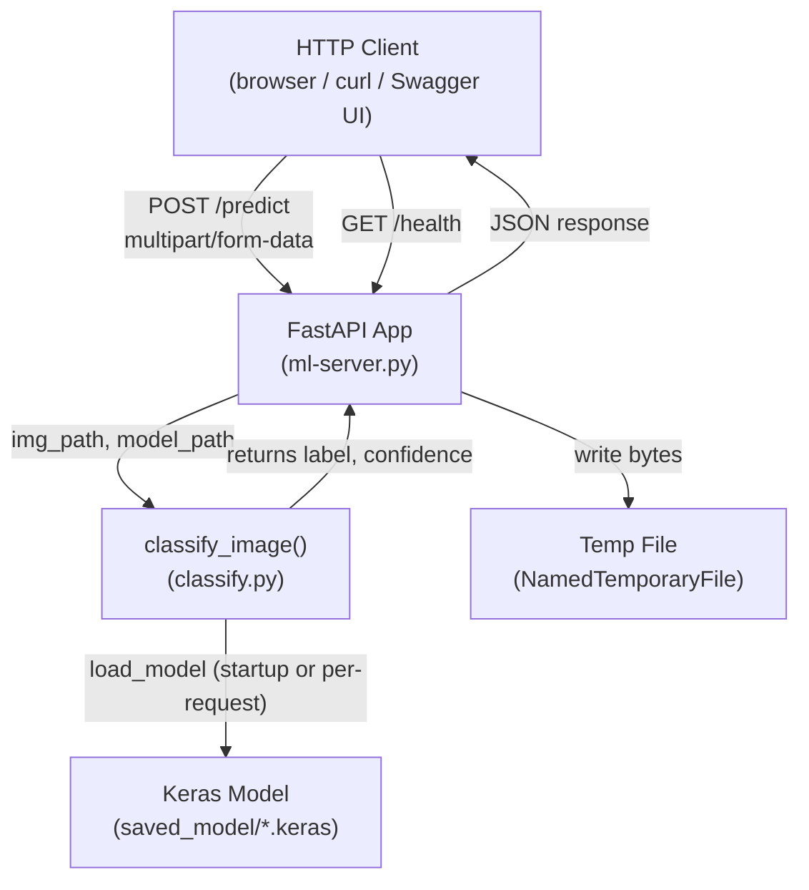

# Design Document — FastAPI Deployment

## Overview

This design covers a lightweight FastAPI REST API that wraps the existing blood cell image classifier (`classify.py`) and exposes it over HTTP. The API is the deliverable for Finals Laboratory 1 (Event-Driven Programming). It is intentionally minimal: one prediction endpoint, one health endpoint, and auto-generated Swagger UI — no database, no authentication, no background workers.

The key design constraint is **reuse**: the API must call `classify_image()` from `classify.py` unchanged. All image preprocessing (resize to 150×150, normalize to [0, 1]) already happens inside that function, so the API layer only needs to handle HTTP concerns: file upload, content-type validation, error mapping, and JSON serialization.

### Goals

- Expose `POST /predict` accepting a multipart image upload and returning `predicted_class` + `confidence`.
- Expose `GET /health` for liveness checks.
- Load the default model once at startup using FastAPI's lifespan context manager.
- Support optional per-request model selection via a `model` query parameter.
- Validate file type (JPEG/PNG only) and return structured error responses.
- Serve Swagger UI at `/docs` and ReDoc at `/redoc` (FastAPI built-in).

### Non-Goals

- Authentication or rate limiting.
- Batch prediction (multiple images per request).
- Model training or retraining via the API.
- Persistent storage of predictions.

---

## Architecture

The application is a single-process FastAPI app run with Uvicorn. There are no external services or databases.



**Request flow for `POST /predict`:**

1. FastAPI receives the multipart upload and reads the file bytes into memory.
2. The endpoint validates the MIME type (`image/jpeg` or `image/png`).
3. The bytes are written to a `NamedTemporaryFile` on disk (required because `classify_image()` accepts a file path, not bytes).
4. `classify_image(img_path, model_path)` is called. It loads the model (from the in-memory cache or from disk for a custom model), preprocesses the image, and returns `(label, confidence)`.
5. The temp file is deleted.
6. The API returns a JSON response.

**Startup / shutdown (lifespan):**

The default model is loaded once during startup using FastAPI's `lifespan` context manager and stored in `app.state.model`. This avoids the cold-start penalty on the first request. If the default model file is missing at startup, a warning is logged and model loading is deferred to the first request.

---

## Components and Interfaces

### `ml-server.py` — FastAPI Application

The single application file. It owns:

- The `lifespan` context manager (startup model load).
- The `POST /predict` endpoint.
- The `GET /health` endpoint.
- Input validation helpers.
- Exception handlers.

```python
# Public interface (endpoints)

POST /predict
  Form field : file (UploadFile)
  Query param: model (str, optional) — filename inside saved_model/
  Returns    : PredictionResponse (200) | ErrorResponse (400, 404, 422, 500)

GET /health
  Returns    : {"status": "ok"} (200)
```

### `classify.py` — Classifier (existing, unchanged)

```python
def classify_image(img_path: str, model_path: str = None) -> tuple[str, float]:
    """
    Loads model from model_path (or DEFAULT_MODEL), preprocesses img_path
    (resize 150×150, normalize [0,1]), runs inference.
    Returns (predicted_label: str, confidence: float).
    """
```

The API calls this function directly. No wrapper class is introduced — keeping it simple.

### Pydantic Response Models

```python
class PredictionResponse(BaseModel):
    predicted_class: str   # one of CLASS_LABELS
    confidence: float      # rounded to 4 decimal places

class HealthResponse(BaseModel):
    status: str            # always "ok"

class ErrorResponse(BaseModel):
    error: str             # human-readable description
```

---

## Data Models

### Request

| Field | Type | Source | Constraints |
|-------|------|--------|-------------|
| `file` | `UploadFile` | multipart form | Required; MIME type must be `image/jpeg` or `image/png` |
| `model` | `str` | query parameter | Optional; filename only (e.g. `blood_cell_model_4000.keras`); must exist in `saved_model/` |

### Response — `PredictionResponse`

| Field | Type | Description |
|-------|------|-------------|
| `predicted_class` | `str` | One of `"Eosinophil"`, `"Lymphocyte"`, `"Monocyte"`, `"Neutrophil"` |
| `confidence` | `float` | Model probability for the predicted class, rounded to 4 decimal places (range [0.0, 1.0]) |

### Response — `ErrorResponse`

| Field | Type | Description |
|-------|------|-------------|
| `error` | `str` | Human-readable error message |

### HTTP Status Code Mapping

| Condition | Status Code | Body |
|-----------|-------------|------|
| Successful prediction | 200 | `PredictionResponse` |
| Missing file field | 422 | FastAPI default validation error |
| Unsupported file type | 400 | `ErrorResponse` |
| Image cannot be decoded | 400 | `ErrorResponse` |
| Custom model file not found | 404 | `ErrorResponse` |
| Unhandled exception during inference | 500 | `ErrorResponse` |

### Application State

```python
app.state.model        # tf.keras.Model | None  — default model loaded at startup
app.state.model_path   # str                    — path used to load app.state.model
```

Custom-model requests do **not** cache the loaded model in `app.state`; they load from disk per request. This keeps the design simple for a lab project where custom-model requests are rare.

---

## Correctness Properties

*A property is a characteristic or behavior that should hold true across all valid executions of a system — essentially, a formal statement about what the system should do. Properties serve as the bridge between human-readable specifications and machine-verifiable correctness guarantees.*

### Property 1: Prediction response fields are always valid

*For any* valid JPEG or PNG image uploaded to `POST /predict` (modeled by mocking `classify_image` to return arbitrary `(label, confidence)` pairs drawn from the valid label set and the range [0.0, 1.0]), the response JSON SHALL contain a `predicted_class` field whose value is one of `["Eosinophil", "Lymphocyte", "Monocyte", "Neutrophil"]` and a `confidence` field whose value is a float in the range [0.0, 1.0].

**Validates: Requirements 1.2, 1.4**

### Property 2: Confidence is always rounded to 4 decimal places

*For any* confidence value returned by the classifier (mocked as an arbitrary float in [0.0, 1.0]), the `confidence` field in the API response SHALL satisfy `round(confidence, 4) == confidence`.

**Validates: Requirements 1.4**

### Property 3: Unsupported MIME types are always rejected with HTTP 400

*For any* MIME type string that is not `"image/jpeg"` or `"image/png"`, a POST to `/predict` with that content type SHALL return HTTP 400 with a JSON body containing an `"error"` field equal to `"Unsupported file type. Please upload a JPEG or PNG image."`.

**Validates: Requirements 3.2, 3.4**

### Property 4: Health endpoint always returns `{"status": "ok"}`

*For any* GET request to `/health` (regardless of headers or query parameters), the response SHALL be HTTP 200 with a JSON body where `status == "ok"`.

**Validates: Requirements 4.1, 4.2**

### Property 5: Inference exceptions always produce HTTP 500 and the server remains available

*For any* sequence of requests where one or more requests cause `classify_image` to raise an arbitrary exception, the server SHALL return HTTP 500 with a JSON body containing an `"error"` field for each failing request, AND the server SHALL continue to return HTTP 200 for subsequent valid requests in the same sequence.

**Validates: Requirements 6.1, 6.3**

### Property 6: Non-existent model files always produce HTTP 404

*For any* string passed as the `model` query parameter that does not correspond to an existing file in `saved_model/`, the API SHALL return HTTP 404 with a JSON body containing an `"error"` field.

**Validates: Requirements 2.4**

---

## Error Handling

### Validation Errors (400 / 422)

- **Missing file**: FastAPI's built-in request validation returns 422 automatically when the `file` form field is absent. No custom handler needed.
- **Wrong MIME type**: Checked at the start of the endpoint handler before any file I/O. Returns 400 with `{"error": "Unsupported file type. Please upload a JPEG or PNG image."}`.
- **Corrupt image**: `classify_image()` calls `image.load_img()` which raises an exception if the file cannot be decoded. Caught in the endpoint handler and returned as 400 with a descriptive message.

### Not Found (404)

- **Custom model missing**: When a `model` query parameter is provided, the endpoint checks `os.path.exists(model_path)` before calling `classify_image()`. Returns 404 with `{"error": "Model file not found: <name>"}`.

### Server Errors (500)

- A `try/except Exception` block wraps the entire prediction logic. Any unhandled exception is caught, logged with `traceback.format_exc()` to stdout, and returned as 500 with `{"error": "<exception message>"}`.
- The exception handler does **not** re-raise, so the server process stays alive.

### Startup Warning

- If `saved_model/blood_cell_model_full.keras` is missing at startup, the lifespan function logs `WARNING: Default model not found at <path>. Model will be loaded on first request.` and sets `app.state.model = None`.
- On the first request with no `model` parameter and `app.state.model is None`, the endpoint attempts to load the default model from disk. If it still does not exist, a 500 is returned.

### Temp File Cleanup

- The `NamedTemporaryFile` is created with `delete=False` (required on Windows for `classify_image()` to open it by path). A `finally` block calls `os.unlink(tmp.name)` to ensure cleanup even if inference raises.

---

## Testing Strategy

### Unit Tests

Focus on the pure logic that can be tested without a running server or a real model:

- **MIME type validation**: test that `image/jpeg` and `image/png` pass, and that `image/gif`, `text/plain`, `application/octet-stream`, etc. are rejected.
- **Confidence rounding**: test that `round(confidence, 4) == confidence` for values returned by the endpoint.
- **Error response shape**: test that 400/404/500 responses always include an `"error"` key.
- **Health endpoint**: test that `GET /health` returns `{"status": "ok"}` with status 200.

Use FastAPI's `TestClient` (from `httpx`) for endpoint tests with a mocked `classify_image`.

### Property-Based Tests

Use [Hypothesis](https://hypothesis.readthedocs.io/) (Python PBT library). Each test runs a minimum of 100 iterations.

**Property 1 — Prediction response fields are always valid**
Mock `classify_image` to return arbitrary `(label, confidence)` pairs drawn from the valid label set and [0.0, 1.0] float range using Hypothesis `st.sampled_from` and `st.floats`. Assert `predicted_class in CLASS_LABELS` and `0.0 <= confidence <= 1.0`.
*Tag: Feature: fastapi-deployment, Property 1: prediction response fields are always valid*

**Property 2 — Confidence is always rounded to 4 decimal places**
Mock `classify_image` to return arbitrary floats in [0.0, 1.0] using `st.floats(min_value=0.0, max_value=1.0)`. Assert `round(response["confidence"], 4) == response["confidence"]`.
*Tag: Feature: fastapi-deployment, Property 2: confidence is always rounded to 4 decimal places*

**Property 3 — Unsupported MIME types are always rejected with HTTP 400**
Generate arbitrary MIME type strings using `st.text()` filtered to exclude `"image/jpeg"` and `"image/png"`. Assert the response status is 400 and the body contains `"error"` equal to the exact rejection message.
*Tag: Feature: fastapi-deployment, Property 3: unsupported MIME types are always rejected with HTTP 400*

**Property 4 — Health endpoint always returns ok**
Generate arbitrary header dictionaries and query strings using Hypothesis strategies. Assert `GET /health` always returns 200 and `{"status": "ok"}`.
*Tag: Feature: fastapi-deployment, Property 4: health endpoint always returns ok*

**Property 5 — Inference exceptions always produce HTTP 500 and the server remains available**
Generate sequences of (valid_request, exception_type) pairs using `st.lists`. Mock `classify_image` to raise the given exception for failing requests. Assert each failing request returns 500 with `"error"` in the body, and the next valid request returns 200.
*Tag: Feature: fastapi-deployment, Property 5: inference exceptions always produce HTTP 500 and the server remains available*

**Property 6 — Non-existent model files always produce HTTP 404**
Generate arbitrary strings using `st.text()` that do not match any real filename in `saved_model/`. Assert the response is 404 with an `"error"` field.
*Tag: Feature: fastapi-deployment, Property 6: non-existent model files always produce HTTP 404*

### Integration Tests

Run with a real model file present (or skipped in CI if `saved_model/` is absent):

- Upload a real test image from `data_split_4000/TEST/` and assert the response is 200 with a valid `predicted_class`.
- Upload a non-image file and assert 400.
- Request a non-existent model and assert 404.

### Manual / Smoke Tests

- Start the server with `uvicorn ml-server:app --reload` and open `http://localhost:8000/docs`.
- Use Swagger UI to upload a test image and verify the response.
- Verify `/redoc` renders correctly.
